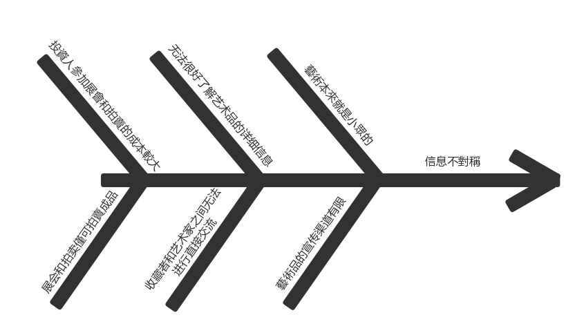
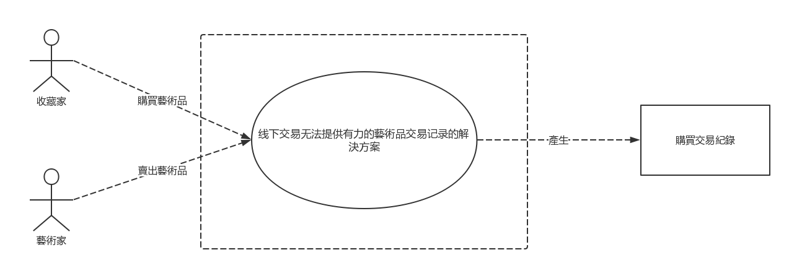
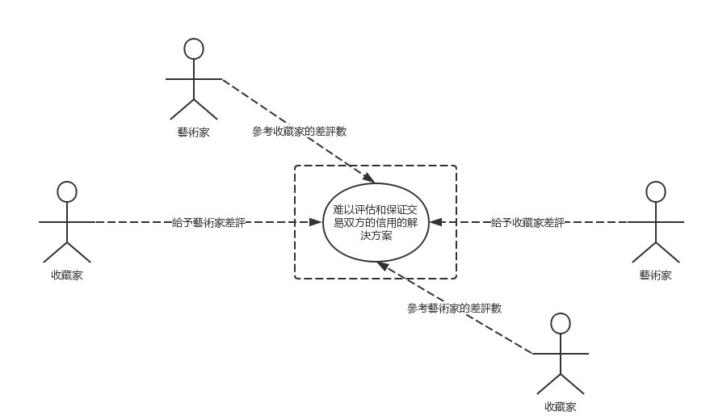
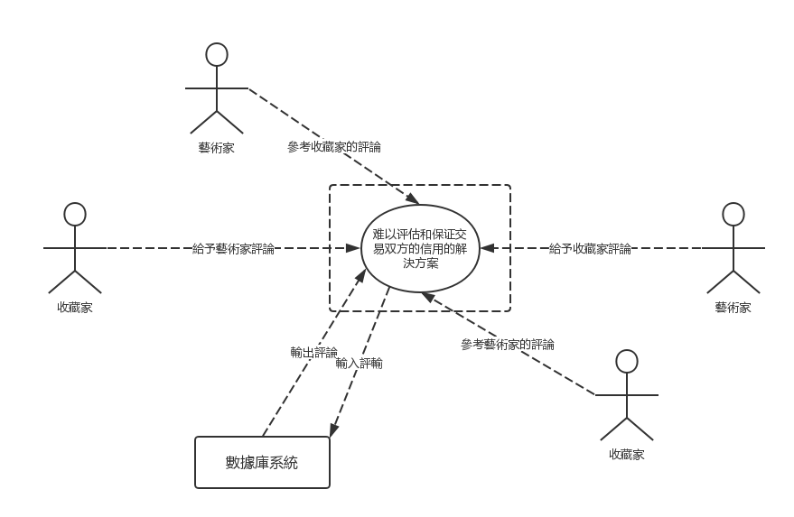
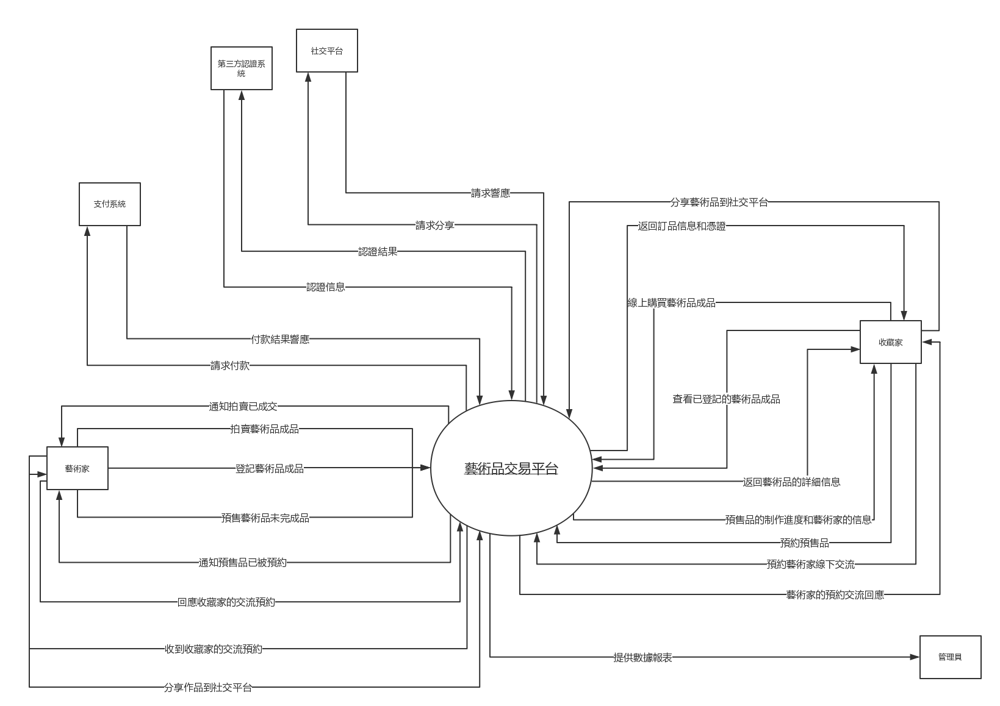
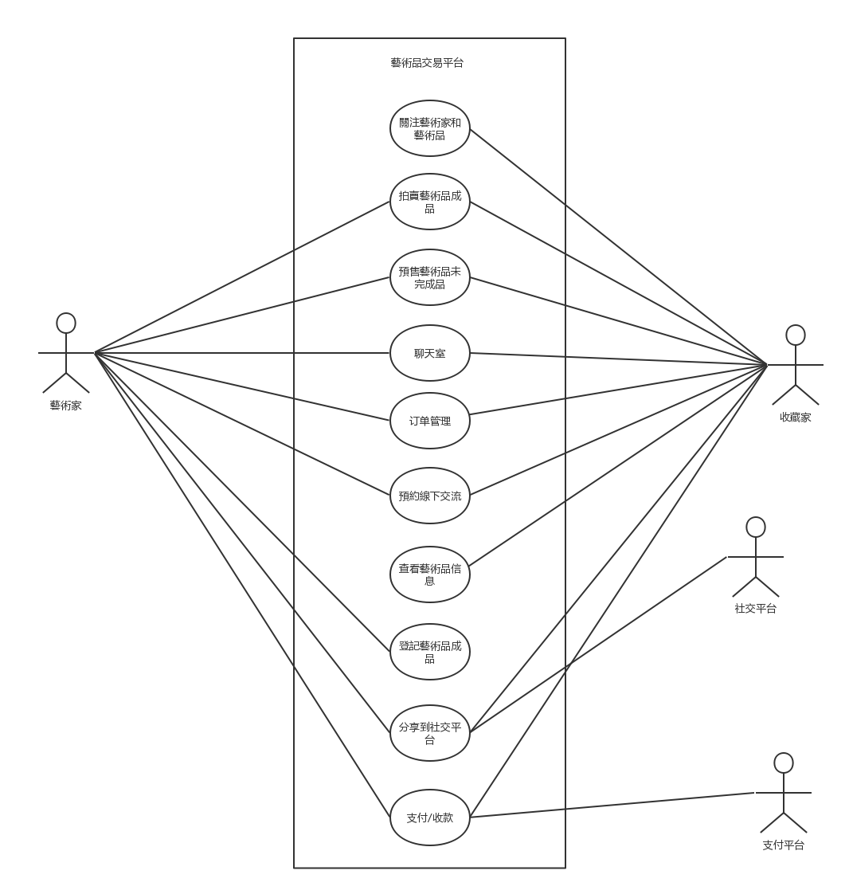

# 艺术品交易系统——问题分析过程

## 文档信息

| 要素 | 内容          |
| --- | ------------- |
| 时间 | 2018年10月4日 |
| 团队 | foursomeSE |
| 成员 | 161250065 连远翔（PM） 161250014 陈骁 161250047 吉宇哲 161250051 赖健明 |

## 目录

<!-- TOC -->

- [艺术品交易系统——问题分析过程](#艺术品交易系统问题分析过程)
    - [文档信息](#文档信息)
    - [目录](#目录)
    - [1. 明确问题](#1-明确问题)
        - [1.1 初步了解问题](#11-初步了解问题)
            - [a. 目前状况与问题：](#a-目前状况与问题)
            - [b. 客户希望实现的功能：](#b-客户希望实现的功能)
            - [c. 总的概括](#c-总的概括)
        - [1.2 问题达成共识](#12-问题达成共识)
    - [2. 涉众分析](#2-涉众分析)
        - [2.1 涉众识別和描述](#21-涉众识別和描述)
        - [2.2 涉众评估](#22-涉众评估)
    - [3. 发现业务需求](#3-发现业务需求)
    - [4. 定义解决方案及系统特性](#4-定义解决方案及系统特性)
        - [4.1 确定高层次的解决方案](#41-确定高层次的解决方案)
        - [4.2 确定系统特性和解决方案的边界](#42-确定系统特性和解决方案的边界)
        - [4.3 确定解决方案的约束](#43-确定解决方案的约束)
        - [4.4 确定系统边界](#44-确定系统边界)

<!-- /TOC -->

## 1. 明确问题

### 1.1 初步了解问题

盛世重收藏，随着市民生活水平的提高，艺术品投资以其独特的文化韵 味和经济价值，成为了高净值人群的新宠。但与此同时，现有的艺术品交易渠道却存在很多问题。业内人氏发现，当今交易者的信息往往是不对称的，由于宣传渠道有限，高端艺术家及其作品信息无法触达至艺术品爱好者的面前， 而当前常见的艺术品宣传方式多采取展会、拍卖的方式，会有展会和拍卖的地域和时间限制，艺术家和收藏者之间的交流也并不通畅。并且，传统的线下交易无法提供有力的交易记录（过往的交易记录是艺术品价值的重要记录），让大量的艺术品投资面临严重的不确定性，同时交易记录也有伪造的可能。此外，艺术品的高额的价格使得购买人在预约购买后对于艺术家是否能按时交货 非常担心，艺术家的信用成为限制交易量的重要问题。

我们小组通过开会讨论，从中提取出了几个客户希望表达的问题和我们开发人员的 疑问并记录下来，然后与客户展开了第一次面谈，面谈报告如下：

| 要素 | 内容 |
| -------------- | ------------------------------------------------------------ |
| 会见者         | 连远翔                                                       |
| 被会见者       | 陈总                                                         |
| 日期           | 2018年9月30日                                                |
| 主题           | 关于艺术品交易系统和面临问题的初步了解                       |
| 会见目标       | 艺术品交易的现状，艺术品交易的问题，客户的希望与目标         |
| 谈话要点       | 简要说明艺术品交易方式，面临问题，对新平台的期望             |
| 被会见者观点   | 以线下为主，信息不畅，质量不佳，需要一个线上平台，对未来有很大期望 |
| 下次会见的目标 | 进一步面谈和了解，对解决方案进行协商和评估                   |

通过这次面谈，我们了解到了该行业的一些情况。

#### a. 目前状况与问题：

1. 艺术品宣传方式单一，范围有限，多采取展会、拍卖的方式

2. 线下交易往往无法提供有力的交易记录

3. 艺术家与收藏家缺乏交流

4. 交易双方往往缺乏信任

#### b. 客户希望实现的功能：

1. 多媒体全方位展示艺术品

2. 完备的交易记录

3. 有卖家与买家交流功能

4. 有信用保证机制

#### c. 总的概括

当前的线下交易方式，在信息交流，记录备案，信用安全等方面存在问题。

### 1.2 问题达成共识

| 要素   | 内容                                                         |
| ------ | ------------------------------------------------------------ |
| ID     | P1                                                           |
| 提出者 | 收藏家                                                       |
| 关联者 | 收藏家                                                       |
| 问题   | 线下交易无法提供有力的艺术品交易记录                         |
| 影响   | 无法通过交易记录体现艺术品的价值，让大量的艺术品投资面临严重的不确定性 |

| 要素   | 内容                                                     |
| ------ | -------------------------------------------------------- |
| ID     | P2                                                       |
| 提出者 | 收藏家                                                   |
| 关联者 | 收藏家，艺术家，管理员                                   |
| 问题   | 难以评估和保证交易双方的信用                             |
| 影响   | 交易有上当受骗的风险，使得交易双方都很担心，交易体验差。 |

| 要素   | 内容                                                         |
| ------ | ------------------------------------------------------------ |
| ID     | P3                                                           |
| 提出者 | 艺术家，收藏家                                               |
| 关联者 | 收藏家，艺术家                                               |
| 问题   | 信息不对称                                                   |
| 影响   | 落后的信息获友渠道无法满足人民群众日益增加的收藏需要，艺术品的价值也往往体现不出来 |

**收集背景资料，判断问题的明确性：**

我们通过收集，结合客户提出的问题，分析和理解问题域，对上述三个问题的明确性做出了初步判断，认为只有第三个问题比较模糊，是不明确的。而其他兩个问题都是明确一致的问题。

**分析不明确的问题，发现问题背后的问题：**

通过进一步收集相关的资料和业务数据，以及与涉众进行接触，我们发现导致信息不对称的可能的原因有多个，我们制作了 P3原因的鱼骨图如下：

为此我们决定放弃P3，将其拆解为P3，P4，P5如下：

| 要素   | 内容                                                         |
| ------ | ------------------------------------------------------------ |
| ID     | P3                                                           |
| 提出者 | 艺术家                                                       |
| 关联者 | 收藏家，艺术家                                               |
| 问题   | 艺术品的宣传渠道有限                                         |
| 影响   | 高端艺术家及其作品信息无法触达至艺术品爱好者的面前，影响交易机会 |

| 要素   | 内容                                     |
| ------ | ---------------------------------------- |
| ID     | P4                                       |
| 提出者 | 收藏家                                   |
| 关联者 | 收藏家，艺术家                           |
| 问题   | 收藏家无法很好了解艺术品的详细信息       |
| 影响   | 艺术品的价值往往体现不出来，影响交易机会 |

| 要素   | 内容                                     |
| ------ | ---------------------------------------- |
| ID     | P5                                       |
| 提出者 | 收藏家                                   |
| 关联者 | 收藏家，艺术家                           |
| 问题   | 收藏者和艺术家之间交流渠道有限           |
| 影响   | 收藏者和艺术家之间交流不通畅，不利于交易 |

## 2. 涉众分析

### 2.1 涉众识別和描述

在明确问题的同时，我们同步进行了涉众分析。通过涉众识别，我们得到了以下涉众扩展特征描述表：

| 涉众   | 特征                   | 主要目标                            | 态度             | 主要关注点                 | 约束条件                 |
| ------ | ---------------------- | ----------------------------------- | ---------------- | -------------------------- | ------------------------ |
| 艺术家 | 有⼀定的使⽤电⼦产品的技能   | 增加艺术品的宣传渠道，提高艺术品的销售量和销售价值  | 强烈支持 | 使用该平台能够得到更多的关注，销售更多的艺术品 | 无 |
| 收藏家 | 有一定的使用电子产品的能力并且有过网购经历 | 找到心仪的艺术品并且达成可信赖的交易 | 支持，但是担心交易对方的可信度 | 使用该平台能够买到心仪的艺术品并且交易过程简单可信赖 | 无 |
| 管理员 | 具有熟练的使用计算机的能力     | 对平台产生的数据记录进行统计和分析  | 支持   |   数据完整分类明确  | 无    |

### 2.2 涉众评估

为了得到更深层次的涉众信息，我们采用了优先级评估涉众的方法，做出了如下 User/Task 矩阵，用来评估涉众的优先级：

| 用户群体 | 任务 | 群体数量 | 优先级 |
| -------- | ------ |------ |------ |
| 艺术家   | 发布艺术品，展示艺术品信息 | 3000+ | 3      |
| 收藏家   | 查找并购买艺术品，查看艺术品信息 | 30000+ | 2      |
| 管理员   |  查看网站统计数据，管理网站运营  | 30～50 |1      |

## 3. 发现业务需求

确定每一个问题对应得目标的过程就是发现业务需求的过程。因此，针对上述五个高层次问题，我们确定了对应的业务需求。将问题描述表扩展成以下的问题及业务需求描述表：

| 要素   | 内容                                                         |
| ------ | ------------------------------------------------------------ |
| ID     | P1                                                           |
| 提出者 | 收藏家                                                       |
| 关联者 | 收藏家                                                       |
| 问题   | 线下交易无法提供有力的艺术品交易记录                         |
| 影响   | 无法通过交易记录体现艺术品的价值，让大量的艺术品投资面临严重的不确定性 |
| 目标   | 系统上线后，可以保存系统内所有艺术品的每一笔交易记录         |

| 要素   | 内容                                                         |
| ------ | ------------------------------------------------------------ |
| ID     | P2                                                           |
| 提出者 | 收藏家                                                       |
| 关联者 | 收藏家，艺术家，管理员                                       |
| 问题   | 难以评估和保证交易双方的信用                                 |
| 影响   | 交易有上当受骗的风险，使得交易双方都很担心，交易体验差。     |
| 目标   | 在系统使用3个月后，出现艺术家无法交出艺术品或收藏家不支付尾款的次数低于总交易数的5% |

| 要素   | 内容                                                         |
| ------ | ------------------------------------------------------------ |
| ID     | P3                                                           |
| 提出者 | 艺术家                                                       |
| 关联者 | 收藏家，艺术家                                               |
| 问题   | 艺术品的宣传渠道有限                                         |
| 影响   | 高端艺术家及其作品信息无法触达至艺术品爱好者的面前，影响交易机会 |
| 目标   | 在系统使用6个月后，艺术品分享到社交平台的次数达到1万次以上   |

| 要素   | 内容                                     |
| ------ | ---------------------------------------- |
| ID     | P4                                       |
| 提出者 | 收藏家                                   |
| 关联者 | 收藏家，艺术家                           |
| 问题   | 收藏家无法很好了解艺术品的详细信息       |
| 影响   | 艺术品的价值往往体现不出来，影响交易机会 |
| 目标   | 在系统使用6个月后，艺术品的总浏览量达到5万 |

| 要素   | 内容                                     |
| ------ | ---------------------------------------- |
| ID     | P5                                       |
| 提出者 | 收藏家                                   |
| 关联者 | 收藏家，艺术家                           |
| 问题   | 收藏者和艺术家之间交流渠道有限           |
| 影响   | 收藏者和艺术家之间交流不通畅，不利于交易 |
| 目标   | 在系统使用6个月后，收藏夹预约艺术家线下交流的数量达到1万次以上，收藏夹和艺术家的线上聊天记录总数达到10万条以上 |

## 4. 定义解决方案及系统特性

### 4.1 确定高层次的解决方案

首先，我们对每一个明确一致的问题都尽可能发现各种可行的解决方案：

| 问题 | 解决方案                                                     |
| ---- | ------------------------------------------------------------ |
| P1   | S1：对双方的交易结果进行记录，以供追踪 S2：双方在交易过程中邀请本平台的工作人员陪同 S3：双方前往本平台的公司会议室进行线下交易 |
| P2   | S1：双方交易前必须进行认证，交易过程在平台备案，保存交易凭证，交易结束后提供相互评价的功能 S3：签署合约，若出现艺术家无法交出艺术品或收藏家不支付尾款的情况，则判违约并支付违约金 |
| P3   | S1：用户可以发布艺术品介绍，或者分享艺术品到社交平台 S2：艺术家可以付费委托平台对其作品做广告 |
| P4   | S1：系统提供搜索功能，让收藏家可以查找到相应的艺术品，收藏夹可以看到艺术品的交易历史和动态 |
| P5   | S1：系統提供收藏者和艺术家之间的聊天和预约功能，收藏家可以对艺术家进行关注， 并且收到艺术家的最新动态 S2：收藏家可以关注艺术家的instergram或facebook等社交账号 |

然后，我们对每个问题分析不同方案的业务优势和代价，将它们一一用标准化的格式描述成表：

| 解决方案 | 内容                                                     |
| ------- | -------------------------------------------------------- |
| ID       | P1                                                       |
| 方案描述 | 对双方的交易结果进行记录，以供追踪                       |
| 业务优势 | 线上交易的记录可以长期保存，可以随时查询，并且难以伪造。 |
| 代价     | 实现此功能模块所需的软件费用，服务器和数据库的使用开支   |

| 解决方案 | 内容                                         |
| ------- | -------------------------------------------- |
| ID       | P1                                           |
| 方案描述 | 双方在交易过程中邀请本平台的工作人员陪同     |
| 业务优势 | 确保交易过程留下足够的凭证，保证交易的可靠性 |
| 代价     | 为此服务增加的员工工作量，消耗的时间成本     |

| 解决方案 | 内容                                             |
| ------- | ------------------------------------------------ |
| ID       | P1                                               |
| 方案描述 | 双方前往本平台的公司会议室进行线下交易           |
| 业务优势 | 增进艺术家、收藏家、平台三方的交流，明确交易流程 |
| 代价     | 消耗的时间成本，场地的租金                       |

| 解决方案 | 内容                                                         |
| -------- | ------------------------------------------------------------ |
| ID       | P2                                                           |
| 方案描述 | 双方交易前必须进行认证，交易过程在平台备案，保存交易凭证，交易结束后提供相互评价的功能 |
| 业务优势 | 线上支付的便利性可以吸引艺术家和收藏家双方，同时可以很好地保存双方信用以供日后参考 |
| 代价     | 实现此功能模块所需的软件费用，开通网上支付手段所需的手续费用 |

| 解决方案 | 内容                                                         |
| -------- | ------------------------------------------------------------ |
| ID       | P2                                                           |
| 方案描述 | 签署合约，若出现艺术家无法交出艺术品或收藏家不支付尾款的情况，则判违约并支付违约金 |
| 业务优势 | 通过法律文书约束买卖双方的行为，降低信用风险                 |
| 代价     | 增加员工的工作量，降低对于艺术家和收藏家的吸引力             |

| 解决方案 | 内容                                             |
| -------- | ------------------------------------------------ |
| ID       | P3                                               |
| 方案描述 | 用户可以发布艺术品介绍，或者分享艺术品到社交平台 |
| 业务优势 | 方便了艺术品的展示和分享，拓宽艺术品宣传渠道     |
| 代价     | 实现此功能模块所需的软件费用                     |

| 解决方案 | 内容                                           |
| -------- | ---------------------------------------------- |
| ID       | P3                                             |
| 方案描述 | 艺术家可以付费委托平台对其作品做广告           |
| 业务优势 | 通过集中性的商业广告能够迅速扩大艺术品的影响力 |
| 代价     | 宣传人员的工资，商业广告的广告费               |

| 解决方案 | 内容                                                         |
| -------- | ------------------------------------------------------------ |
| ID       | P4                                                           |
| 方案描述 | 系统提供搜索功能，让收藏家可以查找到相应的艺术品，收藏家可以看到艺术品的交易历史和动态 |
| 业务优势 | 提供统一的平台和查找功能，方便收藏家及时准确地了解艺术品最新信息 |
| 代价     | 实现此功能模块所需的软件费用，服务器和数据库的使用开支       |

| 解决方案 | 内容                                                         |
| -------- | ------------------------------------------------------------ |
| ID       | P5                                                           |
| 方案描述 | 系統提供收藏者和艺术家之间的聊天和预约功能，收藏家可以对艺术家进行关注， 并且收到艺术家的最新动态 |
| 业务优势 | 拓宽收藏家和艺术家的交流渠道，方便收藏家了解艺术品市场的最新进展 |
| 代价     | 实现此功能模块所需的软件费用，服务器和数据库的使用开支       |

| 解决方案 | 内容                                                 |
| -------- | ---------------------------------------------------- |
| ID       | P5                                                   |
| 方案描述 | 收藏家可以关注艺术家的instergram或facebook等社交账号 |
| 业务优势 | 方便收藏家和艺术家的进一步深入了解                   |
| 代价     | 社交网站对于本平台的分流，登陆部分国外网站的不便     |

接着，我们与客户召开了第二次面谈，为每个问题的几种解决方案协商取得一致意见。以下是第二次面谈报告。

| 要素           | 内容                                                         |
| -------------- | ------------------------------------------------------------ |
| 会见者         | 陈骁                                                         |
| 被会见者       | 张总                                                         |
| 日期           | 2018年10月3日                                                |
| 主题           | 明确具体问题和探讨解决方案                                   |
| 会见目标       | · 明确上次面谈中模糊的问题 · 评估和明确各个问题的解决方案 |
| 谈话要点       | · 艺术品交易困境的具体原因分析 · 部分解决方案被优先选择  |
| 被会见者观点   | · 艺术品交易的困境源于信息不对称、交易记录难以追踪、你仍按难以建立 · 每个问题都已经明确 · 问题的结局方案确定 |
| 下次会见的目标 | · 对于以前的谈话结果进行商讨和最终定版 · 审阅项目前景和范围文档 |

最后，通过此次面谈和探讨，开发人员和客户对每个问题都共同确定了以下高层次解决方案：

| 解决方案 | 内容                                                     |
| -------- | -------------------------------------------------------- |
| ID       | P1                                                       |
| 方案描述 | 对双方的交易结果进行记录，以供追踪                       |
| 业务优势 | 线上交易的记录可以长期保存，可以随时查询，并且难以伪造。 |
| 代价     | 实现此功能模块所需的软件费用，服务器和数据库的使用开支   |

| 解决方案 | 内容                                                         |
| -------- | ------------------------------------------------------------ |
| ID       | P2                                                           |
| 方案描述 | 双方交易前必须进行认证，交易过程在平台备案，保存交易凭证，交易结束后提供相互评价的功能 |
| 业务优势 | 线上支付的便利性可以吸引艺术家和收藏家双方，同时可以很好地保存双方信用以供日后参考 |
| 代价     | 实现此功能模块所需的软件费用，开通网上支付手段所需的手续费用 |

| 解决方案 | 内容                                             |
| -------- | ------------------------------------------------ |
| ID       | P3                                               |
| 方案描述 | 用户可以发布艺术品介绍，或者分享艺术品到社交平台 |
| 业务优势 | 方便了艺术品的展示和分享，拓宽艺术品宣传渠道     |
| 代价     | 实现此功能模块所需的软件费用                     |

| 解决方案 | 内容                                                         |
| -------- | ------------------------------------------------------------ |
| ID       | P4                                                           |
| 方案描述 | 系统提供搜索功能，让收藏家可以查找到相应的艺术品，收藏家可以看到艺术品的交易历史和动态 |
| 业务优势 | 提供统一的平台和查找功能，方便收藏家及时准确地了解艺术品最新信息 |
| 代价     | 实现此功能模块所需的软件费用，服务器和数据库的使用开支       |

| 解决方案 | 内容                                                         |
| -------- | ------------------------------------------------------------ |
| ID       | P5                                                           |
| 方案描述 | 系統提供收藏者和艺术家之间的聊天和预约功能，收藏家可以对艺术家进行关注， 并且收到艺术家的最新动态 |
| 业务优势 | 拓宽收藏家和艺术家的交流渠道，方便收藏家了解艺术品市场的最新进展 |
| 代价     | 实现此功能模块所需的软件费用，服务器和数据库的使用开支       |

### 4.2 确定系统特性和解决方案的边界

在选定解决方案之后，我们进一步明确了该解决方案需要具备的功能特征，即系统特征：

| 针对的问题 | 解决方案需要具备的系统特性                                   |
| ---------- | ------------------------------------------------------------ |
| P1         | 1. 系统保存艺术品的每一笔交易记录                            |
| P2         | 1. 系统根据历史交易记录、评价和认证信息来建立信用体系，评估艺术家和收藏家的信用 2. 系统允许用户之间在平台内交易并支付，并记录交易全过程和凭证 |
| P3         | 1. 系统允许用户互相关注并发布动态和共享                      |
| P4         | 1. 系统允许收藏家对艺术品进行搜索，筛选并展示艺术品的详细信息 |
| P5         | 1. 系统提供收藏者和艺术家之间的聊天和预约功能                |

然后根据这些功能特征，分析解决方案需要和周围环境形成的交互作用，定义解决方案的边界。解决方案的边界确定了信息流的输入输出关系：

### 4.3 确定解决方案的约束

约束在总体上限制了开发人员设计和构建系统时的选择范围。我们从操作性、系统 及操作系统、设备预算、人员资源和技术要求这几个主要的约束源来考察每个解决方案 的约束，如下表所示：

**P1：**

| **约束源**         | **约束**                                               | **理由**               |
| ------------------ | ------------------------------------------------------ | ---------------------- |
| **操作性**         | 交易双方可以查看订单结果，包括对方姓名、电话等个人信息 | 方便买家和卖家之间的交流 |
| **系统与操作系统** | 仅向买家和卖家显示                                     | 保障客户私隐           |
| **设备预算**       | 系统在已架构好的服务器和主机上开发                     | 控制成本，方便         |
| **人员资源**       | /                                                      | /                      |
| **技术要求**       | 使用DES加密算法保储买家和卖家的个人信息                | 安全性考虑             |

**P2： **

| **约束源**         | **约束**                                                     | **理由**                       |
| ------------------ | ------------------------------------------------------------ | ------------------------------ |
| **操作性**         | 收藏家和艺术家都需要通过身份证及实名认证                     | 增加交易的可靠性               |
| **系统与操作系统** | 接入提供OCR的平台，进行身份证认证                            | 更有效、无误地进行验证         |
| **设备预算**       | 系统在已架构好的服务器和主机上开发；选择免费提供OCR接入的平台 | 控制成本，方便                 |
| **人员资源**       | /                                                            | /                              |
| **技术要求**       | 利用OCR进过身份证认证；利用人脸对比进行证件相片与本人的验证  | 避免艺术家及收藏家盗用他人身份 |

**P3： **

| **约束源**         | **约束**                                  | **理由**                                                |
| ------------------ | ----------------------------------------- | ------------------------------------------------------- |
| **操作性**         | 艺术家发艺术品介绍的点击次数不超过6次     | 避免複离的操作；简化流程                                |
| **系统与操作系统** | 支持分享至微博、微信、Facebook、Instagram | 分享至活跃的社交平台可提高知名度和热度                  |
| **设备预算**       | 系统在已架构好的服务器和主机上开发        | 控制成本，方便                                          |
| **人员资源**       | /                                         | /                                                       |
| **技术要求**       | 使用J2EE平台                              | Web方式符合互联网发展趋势，同时J2EE的开源性质可降低成本 |

**P4： **

| **约束源**         | **约束**                                              | **理由**                 |
| ------------------ | ----------------------------------------------------- | ------------------------ |
| **操作性**         | 收藏家查找艺术品的点击次数不超6次；寻找栏应在当眼位置 | 避免複离的操作；简化流程 |
| **系统与操作系统** | 系统响应查找的时间不应超过4秒                         | 保证用户意识流的一致性   |
| **设备预算**       | 系统在已架构好的服务器和主机上开发                    | 控制成本，方便           |
| **人员资源**       | /                                                     | /                        |
| **技术要求**       | 使用Elastic Search                                    | 适合J2EE平台，免费，高效 |

**P5： **

| **约束源**         | **约束**                                                     | **理由**                     |
| ------------------ | ------------------------------------------------------------ | ---------------------------- |
| **操作性**         | 关注数显示在艺术家的当眼位置；艺术家及收藏家可在系统选择是否接受预约 | 可提高艺术家热度；提供灵活性 |
| **系统与操作系统** | 系统提供实时、多个单对单的聊天功能；                         | 增加买卖家交流的效率；       |
| **设备预算**       | 系统在已架构好的服务器和主机上开发                           | 控制成本，成本               |
| **人员资源**       | /                                                            | /                            |
| **技术要求**       | /                                                            | /                            |

### 4.4 确定系统边界

最后将所有问题的解决方案进行综合，就可以得到整个解系统的功能和边界。为了更直观地描述系统的功能和边界，我们绘制了艺术品交易平台的上下文图。

在这个上下文图中表示出了所有和餐饮系统交互的外部实体，并描述出了交互的数据流， 包括系统输入和系统输出：

另外，为了直接记录和描述从用户那里得到的信息，我们采用面向对象的方法以系统的所有用例的集合为基础，建立了用例模型，用统一、图形化的方式展示系统的功能和行为特性。以下是我们的用例图：

