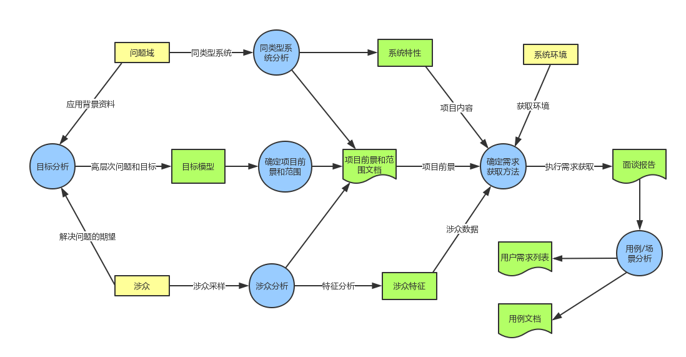
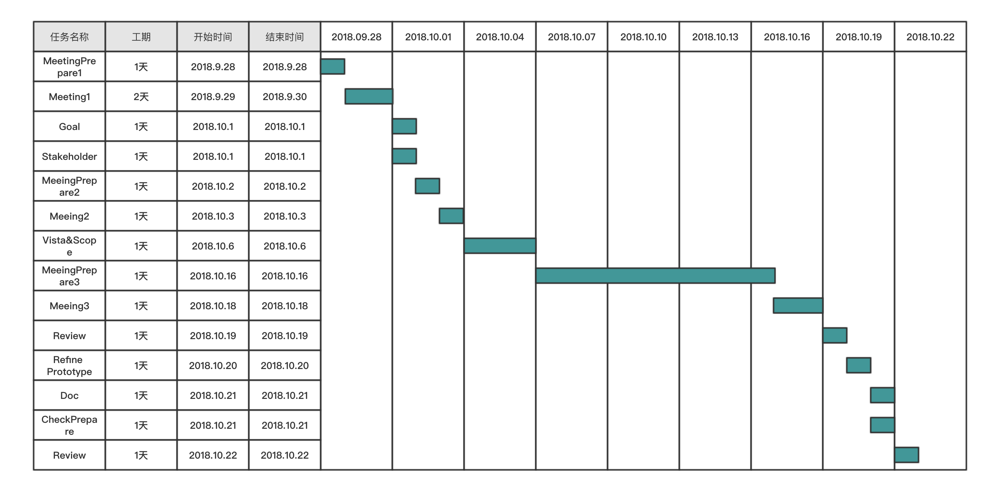

# 艺术品交易系统——需求获取计划书

 

## 文档信息

| 要素 | 内容          |
| --- | ------------- |
| 时间 | 2018年10月17日 |
| 团队 | foursomeSE |
| 成员 | 161250065 连远翔（PM） 161250014 陈骁 161250047 吉宇哲 161250051 赖健明 |

 

## 目录
<!-- TOC -->

- [艺术品交易系统——需求获取计划书](#艺术品交易系统需求获取计划书)
    - [1. 引言](#1-引言)
        - [1.1 编制目的](#11-编制目的)
        - [1.2 词汇表](#12-词汇表)
    - [2. 需求获取计划概要](#2-需求获取计划概要)
        - [2.1 需求获取活动](#21-需求获取活动)
        - [2.2 需求获取流程](#22-需求获取流程)
        - [2.3 需求获取时间表](#23-需求获取时间表)
    - [3. 需求获取各阶段明细](#3-需求获取各阶段明细)
        - [3.1 研究应用背景，建立知识框架](#31-研究应用背景建立知识框架)
        - [3.2 目标分析，获取项目前景和范围](#32-目标分析获取项目前景和范围)
        - [3.3 选择获取方法](#33-选择获取方法)
            - [3.3.1 半结构化面谈](#331-半结构化面谈)
            - [3.3.2 结构化面谈](#332-结构化面谈)
            - [3.3.3 静态原型](#333-静态原型)
            - [3.3.4 场景串联图板](#334-场景串联图板)
            - [3.3.5 交互式原型](#335-交互式原型)
        - [3.4 执行获取](#34-执行获取)
            - [3.4.1 获取计划](#341-获取计划)
            - [3.4.2 甘特图](#342-甘特图)
    - [4.跟踪与反馈](#4跟踪与反馈)

<!-- /TOC -->

 

 

## 1. 引言

### 1.1 编制目的

艺术品交易系统是一个面向艺术家与收藏者的在线艺术品交易平台，主要提供艺术品交易功能以及艺术品交易记录追踪服务。借助本平台，高端艺术家与艺术品收藏者之间的交流可以更加顺畅；同时，艺术品交易的安全性与便捷性得到很好的保障。艺术品投资将成为一个新的热点。

本文档贯穿于整个需求获取阶段，是foursomeSE小组在需求工程实践中在需求获取阶段的实际产物，本文档主要描述了需求获取阶段的计划和安排，提供了一套严谨的需求获取方案，可以作为之后的行动参考和指南，同时为后续的追踪管理提供了重要的文档依据。

 

### 1.2 词汇表

| 用语            | 解释       |
| --------------- | ---------- |
| MeetingPrepare  | 面谈准备   |
| Meeting         | 面谈       |
| Goal            | 目标       |
| Stakeholder     | 涉众       |
| Vista&Scope     | 前景和范围 |
| MeetingAnalysis | 面谈分析   |
| Refine          | 精化       |
| Prototype       | 原型       |
| Doc             | 文档       |
| ReviewPrepare   | 评审准备   |
| Review          | 评审       |

 

 

## 2. 需求获取计划概要

### 2.1 需求获取活动

通过对上一阶段构造的目标模型深入分析和审查之后，结合系统高层目标、系统涉众分析以及系统实际应用场景，确定在需求获取阶段需要开展的活动如下所示：

- 分析并确定系统高层目标，建立完整可靠的目标模型
- 研究应用背景，分析现有的系统，确立自身产品特色
- 涉众分析与描述，硬数据采样，建立涉众模型
- 在目标模型和涉众模型的基础上确定需求获取方法
- 确定活动的内容和场景，严格执行具体的需求获取活动
- 记录需求获取活动的过程和结果，进行分析和汇总
- 基于用例/场景模型进行分析，获得本阶段制品面谈报告与用例文档
- 总结本阶段需求获取活动，对下一阶段进行规划

 

### 2.2 需求获取流程

需求获取流程图如下所示：

 

### 2.3 需求获取时间表

| 需求获取项目| 时间|
|---|---|
|背景知识与框架|2018.9.28|
|目标模型|2018.10.4|
|涉众分析与前景范围|2018.10.6|
|选择获取方法|2018.10.15|
|执行获取|2018.10.18|
|获取结果|2018.10.20|

 

 

## 3. 需求获取各阶段明细

### 3.1 研究应用背景，建立知识框架

需求小组首先对于艺术品投资市场的现状与痛点进行了分析，选择了artsy等同类型艺术品交易平台进行了分析和比较，深入研究应用背景之后建立了较为完整的知识框架。

 

### 3.2 目标分析，获取项目前景和范围

需求小组在应用背景的基础上首先进行了简单的问题分析，从问题入手得到高层次的系统目标。之后通过目标模型的分析方法，进行了目标建模，在此基础之上完成了涉众分析和目标分析，最终形成了过程分析文档、项目前景和范围文档。

 

### 3.3 选择获取方法

综合考虑涉众特点、项目目标、前景与范围以及成本等多方面因素，我们选择一下方法进行需求的具体获取，主要采取的方法是面谈方法和原型方法。

其中，面谈方法是经典的需求获取方法，几乎所有项目都通过面谈方法进行需求获取，这也是我们获取需求的主要方法，它具有成本低、实践容易、提高涉众参与度等优点。

针对面谈方法使用中可能出现的概念结构不同、模糊化描述、默认知识、潜在知识等现象，我们使用原型方法作为主要的补充手段，用于对细节和复杂部分的细化和分析，进一步深入明确需求获取方法。

 

#### 3.3.1 半结构化面谈

- **方法描述**

在项目的初期阶段，需求小组主要以获取的知识框架为基础，进行详细的问题准备，但是选择的问题叙述方式较为多样化，主要用于获取高层次的目标和特性，逐步建立系统的功能需求框架，在此框架的基础上处理逐步细化的探索性问题。

随着需求获取的逐渐深入，每次给出的基础性框架更为明确，探索性问题的针对性和细节性更强，面谈的结构化程度逐渐增强，逐步穿插界面原型，场景方法和故事板方法，已经能够处理绝大多数的需求获取任务。

- **选择理由**

综合考虑面谈效率以及需求开发人员的知识背景，我们决定抛弃非结构化的面谈方法。非结构化面谈的作用十分强大，既能够有效进行面谈的准备和组织，又能够提供适度的灵活性、流出探索的空间。以这种方式进行面谈，在明确系统需求的同时还能充分了解客户的期望、增进开发人员和客户的交流。

 

#### 3.3.2 结构化面谈

- **方法描述**

在需求获取的后期阶段，在完成用例文档和用户需求列表的初稿之后，需求小组通过结构化面谈的方法，逐条审查需求初步产物，通过用户反馈进行查漏补缺工作。同时通过这种方式提示客户项目的进展情况。

- **选择理由**

在项目的后期阶段，系统需求和用户期望等基本明确，于是可以通过结构化面谈的方式明确需求中的细节。结构化面谈通常更加方便、节省时间，可以通过视频会议等方式完成。

 

#### 3.3.3 静态原型

- **方法描述**

在确定项目前景和范围之后，为了逐步细化用户需求，通过用例/场景模型展开需求获取。

在得到了多个场景之后，形成系统用例图，再以此为依据，明确系统和用户之间的交互，同时使用了界面的静态原型，主要以水平层次的原型为主，获得初步的场景流程和功能模块。

- **选择理由**

原型方法能够很好地应对需求的不确定性，同时便于演示以及与用户的交流。在面试的过程中，通过用户的反馈直接修改原型，得到用户满意的界面，降低成本、提高效率。

 

#### 3.3.4 场景串联图板

- **方法描述**

建立场景串联图板，将场景式的互动通过图形界面展示给用户，通过收集和分析用户的反馈信息，进一步明确需求，提高设计完成度。

- **选择理由**

场景串联图板介于静态界面和动态程序之间，把各个界面相互联系起来，成本较低，效果较好，探寻之前可能遗漏的用户交互序列。

 

#### 3.3.5 交互式原型

- **方法描述**

在场景串联图板之后提供交互式原型，复制用户使用，使得用户对于最终的开发产物有感性的认识。通过交互式原型基本形成最终应用程序的功能框架和外部特征，通过用户的使用反馈确定最终的设计结果。

- **选择理由**

高保真的交互式原型具有较好的真实感，同时可以提供接近真实的用户交互行为，提高了用户的参与意愿，同时通过用户实际操作的过程重新审视用户交互序列，修改文档中不足的部分，确定最终的用例设计。

 

### 3.4 执行获取

#### 3.4.1 获取计划

| 活动类型              | 活动概括                                         | 活动具体内容                                                 | 预计完成时间 | 负责人 |
| --------------------- | ------------------------------------------------ | ------------------------------------------------------------ | ------------ | ------ |
| MeetingPrepare1       | 项目收集背景资料                                 | 对系统产生的背景进行深入了解剖析，为后续做好准备             | 2018.9.28    | 连远翔 |
| Meeting1              | 与客户面谈                                       | 第一次面谈，对问题进行明确，了解用户对系统的模糊期望         | 2018.9.29    | 连远翔 |
| Goal                  | 目标分析                                         | 整理第一次面谈的结果，进行问题分析，目标建模                 | 2018.10.1    | 吉宇哲 |
| Stakeholder           | 涉众分析                                         | 进行基于目标模型的涉众分析                                   | 2018.10.2    | 赖健明 |
| MeetingPrepare 2      | 面谈材料和流程准备                               | 将目标模型组织成可汇报易审查的形式，准备问题列表             | 2018.10.3    | 陈骁   |
| Meeting2              | 与客户面谈                                       | 获取用户对目标的反馈，记录面谈内容；以目标模型和系统用例定义为基础，使用纸质原型，获取需求 | 2018.10.3    | 陈骁   |
| Review 1              | 面谈结果汇总、讨论、分析                         | 分析面谈结果，开会讨论，互相补充，达成一致                   | 2018.10.4    | 吉宇哲 |
| Vista&Scope           | 前景与范围定义                                   | 结合用户反馈，对目标精化进行调整，继而完成项目前景和范围的定义，完成前景和范围文档的编写 | 2018.10.5    | 赖健明 |
| Refine 1 Prototype 1 | 精化用例，分析场景，制作场景串联图板和高保真原型 | 对用例进行细化，拆分等，制作场景串联图板和高保真原型         | 2018.10.10   | 赖健明 |
| MeetingPrepare 3      | 面谈材料和流程准备                               | 准备面谈问题列表，设定面谈问题模式，设计制作面谈记录表格，设计场景串联图板和交互式原型 | 2018.10.16   | 连远翔 |
| Meeting3              | 与客户面谈                                       | 进行面谈记录；通过场景串联图板向用户进行演示，通过交互式原型辅助用户操作 | 2018.10.18   | 连远翔 |
| Review 2              | 面谈结果汇总、讨论、分析                         | 分析面谈结果，开会讨论，互相补充，达成一致                   | 2018.10.19   | 吉宇哲 |
|  Refine 2 Doc | 精化用例，用例文档编制，用户需求列表定义         | 对所得用例进行文档化，完成文档初稿编制                       | 2018.10.20  | 连远翔 |
| CheckPrepare          | 评审会议准备                                     | 构建checklist，发放评审准备材料                              | 2018.10.21   | 陈骁   |
| Review                | 需求最终评审                                     | 进行对文档的评审                                             | 2018.10.22   | 吉宇哲 |

 

#### 3.4.2 甘特图

 

 

## 4.跟踪与反馈

| 活动类型              | 备注                       | 预计完成时间 | 实际完成时间 |
| --------------------- | -------------------------- | ------------ | ------------ |
| MeetingPrepare1       |                            | 2018.9.28    | 2018.9.28    |
| Meeting1              | 突发情况，会面推迟         | 2018.9.29    | 2018.9.30    |
| Goal                  |                            | 2018.10.1    | 2018.10.1    |
| Stakeholder           |                            | 2018.10.1    | 2018.10.1    |
| MeetingPrepare 2      |                            | 2018.10.2    | 2018.10.2    |
| Meeting2              | 客户临时有事，改为在线面谈 | 2018.10.3    | 2018.10.3    |
| Review 1             |   | 2018.10.4    | 2018.10.4   |
| Vista&Scope           | 文档量大，完成时间延迟 | 2018.10.5   | 2018.10.6   |
| Refine 1 Prototype 1             |   | 2018.10.4    | 2018.10.4   |
| MeetingPrepare 3      |                            | 2018.10.16   | 2018.10.16   |
| Meeting3              |                            | 2018.10.18   | 2018.10.18   |
| Review 2             |                            | 2018.10.19   | 2018.10.19   |
| Refine 2 Doc |                            | 2018.10.20   | 2018.10.20   |
| CheckPrepare1         |                            | 2018.10.21   | 2018.10.21   |
| Review                | 总结完成                   | 2018.10.22   | 2018.10.22   |