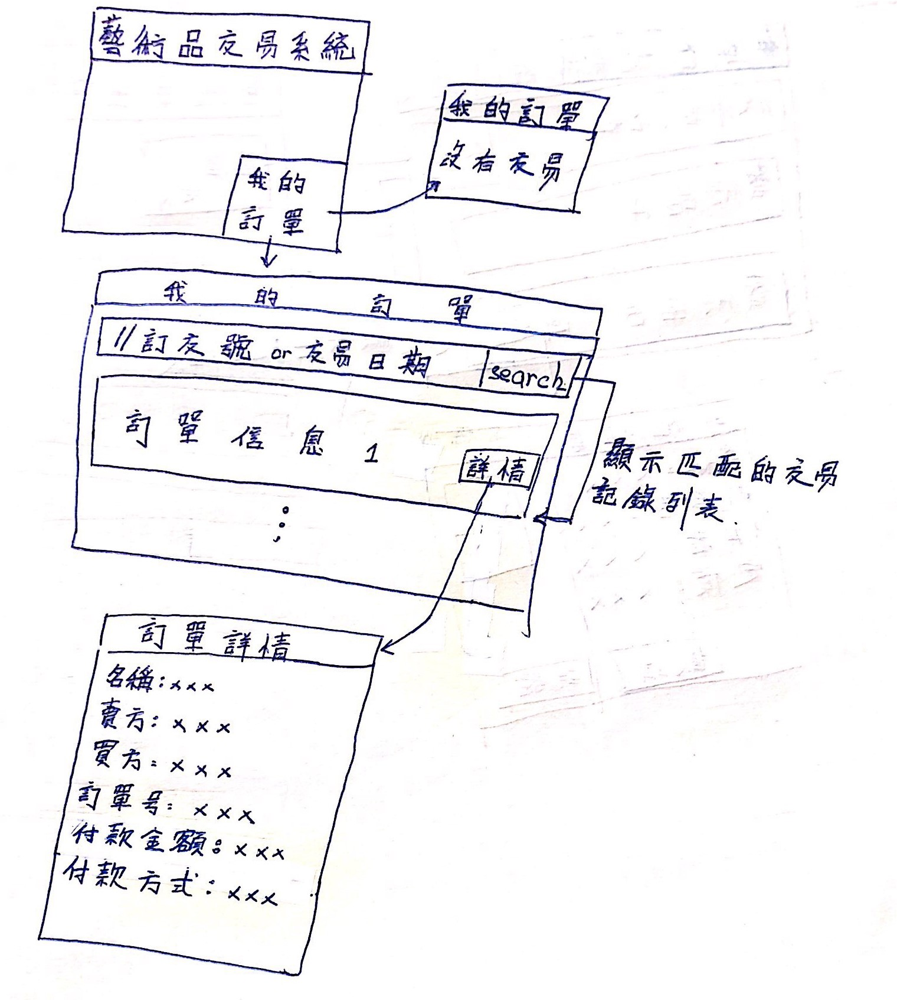

# 面谈报告和原型物件

 

## 文档信息

| 要素 | 内容                                                         |
| ---- | ------------------------------------------------------------ |
| 时间 | 2018年10月19日                                               |
| 团队 | foursomeSE                                                   |
| 成员 | 161250065 连远翔（PM） 161250014 陈骁 161250047 吉宇哲 161250051 赖健明 |

 

## 目录

[TOC]

 

 

 

## 1. 前言

### 1.1 引言

我们通常认为面对面的访谈是一种最具丰富内容的交流方法，同时实践当中应 用最为广泛的需求获取方法之一。同时，通过面谈可以获得的很多信息内容。其 中包括：事实和问题，被会见者的观点，被会见者的感受，组织和个人的目标等 信息。

 

 

### 1.2 目的

本文档旨在通过面对面的会见，从而获取构建就诊信息一体化系统所需要的各 类信息。从而可以细化解决方案中遇到的一些问题，在存在问题的方面与用户之 间达成共识，确定该项目的解决方案。

 

 

### 1.3 阅读说明

本文档主要是需求工程活动中的整个面谈过程为主要内容。通过叙述面谈过 程中的面谈计划，面谈过程，面谈报告以及参考内容。其中内容主要以笔录和电 子文档等方式进行面谈过程的记录工作。

 

 

### 1.4 参考文献

[1]需求工程:软件建模与分析，骆斌、丁二玉，高等教育出版社，2009-0401，ISBN：9787040262957

 

 

 

## 2. 第一次面谈

### 2.1 面谈计划阶段

#### 2.1.1 产生背景

盛世重收藏，随着市民生活水平的提高，艺术品投资以其独特的文化韵 味和经济价值，成为了高净值人群的新宠。但与此同时，现有的艺术品交易渠道却存在很多问题。业内人氏发现，当今交易者的信息往往是不对称的，由于宣传渠道有限，高端艺术家及其作品信息无法触达至艺术品爱好者的面前， 而当前常见的艺术品宣传方式多采取展会、拍卖的方式，会有展会和拍卖的地域和时间限制，艺术家和收藏者之间的交流也并不通畅。并且，传统的线下交易无法提供有力的交易记录（过往的交易记录是艺术品价值的重要记录），让大量的艺术品投资面临严重的不确定性，同时交易记录也有伪造的可能。此外，艺术品的高额的价格使得购买人在预约购买后对于艺术家是否能按时交货 非常担心，艺术家的信用成为限制交易量的重要问题。

 

#### 2.1.2 面淡目的

1.对项目前景和范围进行确认

2.明确业务需求

 

#### 2.1.3 面谈对象

客户：陈俊达

 

#### 2.1.4 面谈类型和面谈结构

（1）开放式问题（Open-Ended）

 

#### 2.1.5 面谈问题

1. 当前艺术品交易行业的大致情形是什么样的？
2. 当前艺术品交易过程中有哪些问题？
3. 希望通过开发这个新平台达到什么目标？具有哪些功能？

 

 

 

### 2.2 面谈具体过程

#### 2.2.1 面谈参与人员

项目组参与人员：

- 连远翔，职位：项目经理

- 陈骁，职位：项目成员

- 赖健明，职位：项目成员

- 吉宇哲，职位：项目成员

客户方参与人员：

- 陈俊达，张凌哲

 

#### 2.2.2  面谈时间

2018年 9 月 30 日

 

#### 2.2.3 面谈地点

肯德基快餐厅

 

#### 2.2.4 面谈项目

艺术品线上交易系统

 

#### 2.2.5 面谈目的

1.对项目前景和范围进行确认

2.明确业务需求

 

#### 2.2.6 面谈方式

通过面对面的会见的方式，同时通过笔录等方式进行面谈内容记录。

 

#### 2.2.7 面谈内容

问：当前艺术品交易行业的大致情形是什么样的？

答：当前艺术品交易的总体行情是好的，据我公司观察，近年来有更多的人有投资或收藏的需要。目前的交易方式大都采用线下交易，在一个城市中进行。以展会和拍卖的形式为主。

 

问：当前艺术品交易过程中有哪些问题？

答：交易形式在线下进行我们认为是不合时宜的，这样传统的交易方式限制了行业的发展，因为线下交易宣传方式单一，范围有限。又因为范围有限，所以交易记录往往很分散，不利于追踪。但是完整的交易纪录对于艺术品交易尤其是投资來说是很重要的。此外，买家要与艺术家获得联系并不容易，一定程度上导致了双方缺乏信任，限制了交易。

 

问：希望通过开发这个新平台达到什么目标？具有哪些功能？

答：我们认为线上交易是大势所趋，希望能够借助这一波互联网大潮革新这个行业，推动这个行业发展。为了发挥线上交易的优势，同时避免线上交易的一些弊端，我们要求这个新平台中包含以下的功能：卖家可以利用多媒体全方位展示艺术品；所有艺术品交易具有完备的交易记录，要求有卖家与买家交流功能，同时又要有信用保证机制。

 

 

### 2.3 面谈报告概要

| 要素         | 内容                                                         |
| :----------- | ------------------------------------------------------------ |
| 会见者       | 连远翔、陈骁、赖健明、吉宇哲                                 |
| 被会见者     | 陈俊达                                                       |
| 面谈日期     | 2018-9-30                                                    |
| 会见目标     | 艺术品交易的现状，艺术品交易的问题，客户的希望与目标         |
| 谈话要点     | 简要说明艺术品交易方式，面临问题，对新平台的期望             |
| 被会见者观点 | 以线下为主，信息不畅，质量不佳，需要一个线上平台，对未来有很大期望 |

 

 

## 3. 第二次面谈

### 3.1 面谈计划阶段

#### 3.1.1 产生背景

在上一次面谈获用信息的基础上，我们组内进行了讨论，分析了用户面对的问题，并针对产生的问题提出了一些解决方案，现需要同甲方讨论对于这些方案以期获得一致的意见。

 

#### 3.1.2 面淡目的

1.对项目前景和范围进行确认

2.分析过程中积累的问题，解决前期需求开发过程中的疑惑及问题

 

#### 3.1.3 面谈对象

客户：张凌哲

 

#### 3.1.4 面谈类型和面谈结构

本次面谈类型主要采取两种类型：开放式问题和封闭式问题

（1）开放式问题（Open-Ended）

（2）封闭式问题（Closed）

 

#### 3.1.5 面谈问题

1. 公司是否在这个平台之外配备一些线下服务，以更好的配合线上平台的运行。例如公司派出员工监督交易。
2. 你公司有哪些岗位的工作需要在该系统中进行？你公司采取哪些手段维持平台的秩序并保证平台的健康运行？例如，艺术品的价格往往难以估量，平台是否打算对此进行管理或指导？
3. 你公司如何盈利？

 

 

### 3.2 面谈具体过程

#### 3.2.1 面谈参与人员

项目组参与人员：

- 连远翔，职位：项目经理

- 陈骁，职位：项目成员

- 赖健明，职位：项目成员

- 吉宇哲，职位：项目成员

客户方参与人员：

- 陈俊达，张凌哲

 

#### 3.2.2  面谈时间

2018年 10 月 3 日

 

#### 3.2.3 面谈地点

肯德基快餐厅

 

#### 3.2.4 面谈项目

艺术品线上交易系统

 

#### 3.2.5 面谈目的

（1） 明确业务需求

（2） 解决前期需求开发过程中的疑惑及问题

 

#### 3.2.6 面谈方式

通过面对面的会见的方式，同时通过笔录等方式进行面谈内容记录。

 

#### 3.2.7 面谈内容

问：公司是否在这个平台之外配备一些线下服务，以更好的配合线上平台的运行。例如公司派出员工监督交易。

答：公司只有10个人， 线下服务牵涉太多，目前将专注与线上平台的运营。

 

问：你公司有哪些岗位的工作需要在该系统中进行？你公司采取哪些手段维持平台的秩序并保证平台的健康运行？例如，艺术品的价格往往难以估量，平台是否打算对此进行管理或指导？

答：我公司目前只有10个人，需要管理员可以查看每一笔交易，并可以警告封号的功能。管理员如果遇到有人发布规定以外的商品，可以强制下架。但是艺术品的价格交由用户自己决定。

 

问：你公司如何盈利？在线上和线下的交易方式中分別怎样收取费用？

答：一是广告。二是对于高额艺术品交易收取一定的中介费。

 

 

### 3.3 面谈报告概要

| 要素           | 内容                                                   |
| :------------- | ------------------------------------------------------ |
| 会见者         | 连远翔、陈骁、赖健明、吉宇哲                           |
| 被会见者       | 陈俊达                                                 |
| 面谈日期       | 2018-10-03                                             |
| 会见目标       | 明确上次⾯谈中模糊的问题，评估和明确各个问题的解决⽅案 |
| 谈话要点       | 部分解决⽅案被优先选择；盈利模式                       |
| 被会见者的观点 | 不采用涉及线下操作的解决方案；中介和广告               |

 

 

 

## 4. 第三次面谈

### 4.1 面谈计划阶段

#### 4.1.1 产生背景

在我小组进行需求开发的过程中，在一些设计细节上遇到了一些问题，需要进一步讨论和确认。同时也需要进一步确认业务需求和公司的运营方式。

 

#### 4.1.2 面淡目的

1.对项目前景和范围进行确认

4.明确具体业务细节

5.明确用户操作偏好

6.分析过程中积累的问题，解决前期需求开发过程中的疑惑及问题

 

#### 4.1.3 面谈对象

客户：陈俊达

 

#### 4.1.4 面谈类型和面谈结构

本次面谈类型主要采取两种类型：开放式问题和封闭式问题

（1）开放式问题（Open-Ended）

（2）封闭式问题（Closed）

 

#### 4.1.5 面谈问题

1. 公司是否有遗留信息系统

   1.1 （如果有，）遗留信息系统的功能是什么？

   1.2 （如果有，）是否打算与新开发的信息系统进行交互？

      1.2.1 （如果是，）那么旧系统和新系统在将来如何进行分工？

   1.3 （如果沒有，）目前不配备信息系统的原因是什么？是因为缺乏什么便利条件？

      1.3.1 你们打算如何克服这些困难？

 

2. 部署该系统后，希望在交易人数，流览量方面发生什么样的变化？

 

3. 艺术品交易采取什么样的形式？比如拍卖，一口价，预售等形式？

   3.1 如果包含拍卖，希望是将传统的拍卖方式搬到网上，约定一个时间点在线上集合买家与卖家进行拍卖。还是在设置较长的一段时间，让买家在这段时间内自由竞价？

   3.2 以及具体流程。例如，如果采取第二种方式，是否允许用户自由设定时长。

 

4. 系统是否侧重于展示功能，允许让用户发布非卖品？

 

5. 是否区分艺术家和收藏家的身份？

 

6. 如何进行实名认证？是否所有交易都需要实名进行？

 

7. 对社交功能有哪些要求？依托于现有社交平台还是发展自己的社交属性？

 

8. 如何才能保证艺术品交易记完整地被记录在本平台，而不是一锤子买卖？

 

 

### 4.2 面谈具体过程

#### 4.2.1 面谈参与人员

项目组参与人员：

- 连远翔，职位：项目经理

- 陈骁，职位：项目成员

- 赖健明，职位：项目成员

- 吉宇哲，职位：项目成员

客户方参与人员：

- 陈俊达，张凌哲

 

#### 4.2.2  面谈时间

2018年 10 月 18 日

 

#### 4.2.3 面谈地点

肯德基快餐厅

 

#### 4.2.4 面谈项目

艺术品线上交易系统

 

#### 4.2.5 面谈目的

（1） 明确业务需求

（2） 明确具体业务细节

（3） 明确用户操作偏好

（4） 解决前期需求开发过程中的疑惑及问题

 

#### 4.2.6 面谈方式

通过面对面的会见的方式，同时通过笔录等方式进行面谈内容记录。

 

#### 4.2.7 面谈内容

问：公司是否有遗留信息系统？如果沒有，为什么不具备？

答：我公司是新成立的创业公司。

 

问：部署该系统后，希望在交易人数，流览量方面发生什么样的变化？

答：3个月后，流览人数连到20万次，1年后，平台建立足够的信用，有承担价值300万元的交易的案历。

 

问：艺术品交易采取什么样的形式？比如拍卖，一口价，预售等形式？如果包含拍卖，希望是将传统的拍卖方式搬到网上，约定一个时间点在线上集合买家与卖家进行拍卖。还是在设置较长的一段时间，让买家在这段时间内自由竞价？

答：平台包含拍卖，标价交易两种形式。拍卖采用上述第一种形式，因为更正式，更易产生信任感。

 

问：系统是否侧重于展示功能，允许让用户发布非卖品？

答：在现阶段沒有必要，用户如果有这个需求可以自行设置天价。

 

问：是否区分艺术家和收藏家的身份？

答：由于艺术品不是量产，并且为了方便投资交易的需要，不区分。未来有可能会考虑吸引大机构入驻或平台自营等形式。

 

问：如何进行实名认证？是否所有交易都需要实名进行？

答：只要进行交易，就必须经过了实名认证。

 

问：对社交功能有哪些要求？依托于现有社交平台还是发展自己的社交属性？

答：本平台目前只要能实现关注和私聊。

 

问：如何才能保证艺术品交易记完整地被记录在本平台，而不是一锤子买卖？

答：沒有强制身段保证。但是如果用户持续在本平台购买和售出，可以凭借本平台完备的交易记录轻松地追踪到这個艺术品的创作者那里。这对艺术品的价值提供有力的证明。

 

 

### 4.3 面谈报告概要

| 要素           | 内容                                                         |
| :------------- | ------------------------------------------------------------ |
| 会见者         | 连远翔、陈骁、赖健明、吉宇哲                                 |
| 被会见者       | 陈俊达                                                       |
| 面谈日期       | 2018-10-18                                                   |
| 会见目标       | 1.对项目前景和范围进行确认 2.明确具体业务细节 3.明确用户操作偏好 4.分析过程中积累的问题，解决前期需求开发过程中的疑惑及问题 |
| 谈话要点       | 公司现状；交易方式；运营方式                                 |
| 被会见者的观点 | 创业小公司；标价和拍卖；注重交易，目前不在意展示社交         |

 

 

 

## 5. 原型物件

### 5.1 艺术家与收藏家参与拍卖

 

 

### 5.2 浏览艺术品大厅

 

 

### 5.3 浏览艺术家中心

 

 

### 5.4 浏览商品

 

 

### 5.5 预约线下交流

 

 

### 5.6 购买艺术品

 

 

### 5.7 邀请新用户注册

 

 

### 5.8 登记艺术品

 

 

### 5.9 浏览我的订单

 

 

### 5.10 管理员查看交易

 

 

### 5.11 管理员查看发布

 

 

### 5.12 上架艺术品

 

 

### 5.13 管理员查看统计信息

