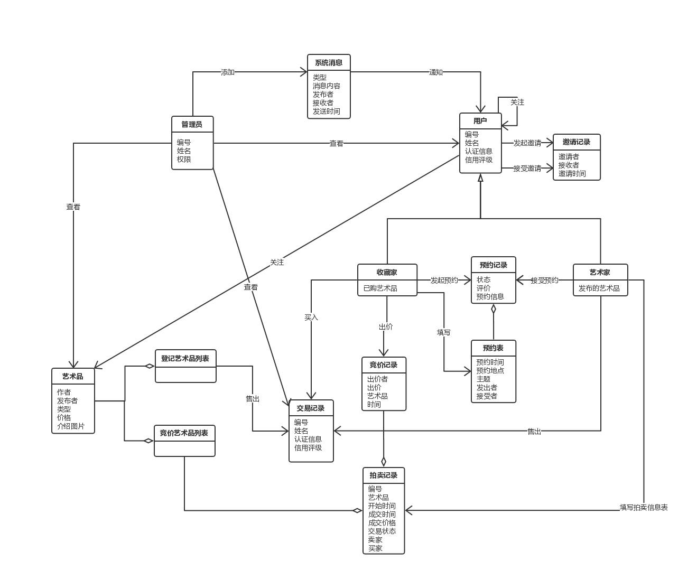
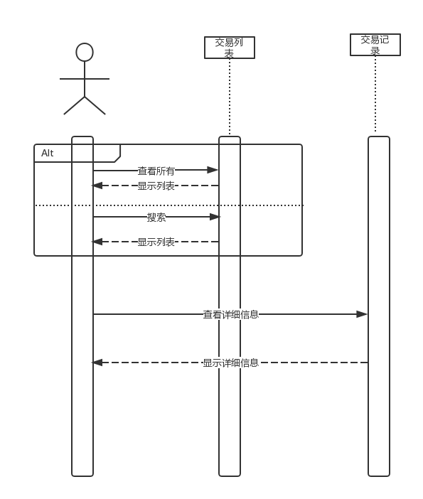

# 艺术品交易平台——分析模型文档

 

 

## 文档信息

| 要素 | 内容                                                         |
| ---- | ------------------------------------------------------------ |
| 时间 | 2018年11月8日                                                |
| 团队 | foursomeSE                                                   |
| 成员 | 161250065 连远翔（PM） 161250014 陈骁 161250047 吉宇哲 161250051 赖健明 |

 

 

## 目录

[TOC]

 

 

 

## 1. 概念类图

 

 

 

## 2. 用例图

 

 

 

## 3. 详细用例说明

根据《艺术品交易平台——用例文档》，对各用例进行面向对象分析建模后的结果如下：

 

 

### 3.1 查看艺术品

#### 3.1.1 查看艺术品——活动图

 

#### 3.1.2 查看艺术品——顺序图

 

#### 3.1.3 查看艺术品——状态图

 

 

### 3.2 查看艺术家

#### 3.2.1 查看艺术家——活动图

 

#### 3.1.2 查看艺术品——顺序图

 

#### 3.1.3 查看艺术品——状态图

 

 

### 3.3 登记艺术品

#### 3.3.1 登记艺术品——活动图

 

#### 3.3.2 登记艺术品——顺序图

 

#### 3.3.3 登记艺术品——状态图

 

 

### 3.4 交易追踪

#### 3.4.1 交易追踪——活动图

 

#### 3.4.2 交易追踪——顺序图

 

#### 3.4.3 交易追踪——状态图

 

 

### 3.5 预约线下交流

#### 3.5.1 预约线下交流——活动图

 

#### 3.5.2 预约线下交流——顺序图

 

#### 3.5.3 预约线下交流——状态图

 

 

### 3.6 艺术品拍卖

#### 3.6.1 艺术品拍卖——活动图

 

#### 3.6.2 艺术品拍卖——顺序图

 

#### 3.6.3 艺术品拍卖——状态图

 

 

### 3.7 艺术品交易

#### 3.7.1 艺术品交易——活动图

 

#### 3.7.2 艺术品交易——顺序图

 

#### 3.7.3 艺术品交易——状态图

 

 

### 3.8 用户邀请

#### 3.8.1 用户邀请——活动图

 

#### 3.8.2 用户邀请——顺序图

 

#### 3.8.3 用户邀请——状态图

 

 

### 3.9 管理统计信息

#### 3.9.1 管理统计信息——活动图

 

#### 3.9.2 管理统计信息——顺序图

 

#### 3.9.3 管理统计信息——状态图

 

 

### 3.10 查看交易

#### 3.10.1 查看交易——活动图

 

#### 3.10.2 查看交易——顺序图

 

#### 3.10.3 查看交易——状态图

 

 

### 3.11 查看发布

#### 3.11.1 查看发布——活动图

 

#### 3.11.2 查看发布——顺序图

 

#### 3.11.3 查看发布——状态图

