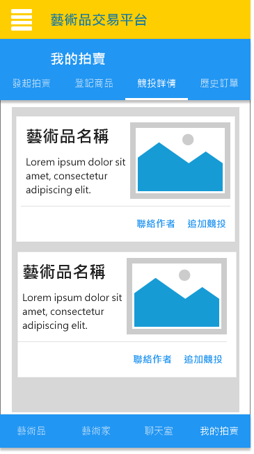

```
TBD
```

## 三. 詳細需求描述
### 3.1 對外接口需求
#### 3.1.1 用戶界面
##### UC1 移動端首頁

- UC1.1 點擊"更多"查看藝術品詳細信息
- UC1.2 點擊"關注", 彈出對話框提示"關注藝術品成功"
- UC1.3 點擊購買, 彈下以下對話框

    - UC1.3.1 點擊"支付寶", 跳到支付寶進行付款
    - UC1.3.2 點擊"微信支付", 跳到微信進行付款
    - UC1.3.3 點擊"聯絡賣家", 前往聊天室發送線下交流申請
- UC1.4 向下滑動可繼續顯示藝術品
- UC1.5 可在上方搜索欄進行藝術品的搜索
- UC1.6 "藝術品圖片"可左右滑動查看


##### UC2 藝術家大廳

- UC2.1 點擊"預約線下", 跳到聊天室發送線下交流申請
- UC2.2 點擊"聊天", 跳到聊天室與藝術家進行交流
- UC2.3 點擊"關注", 彈出對話框提示"關注藝術家成功"
- UC2.4 點擊"藝術家名稱"或者"藝術家頭像"可進入個人主頁
- UC2.5 可在上方搜索欄進行藝術家的搜索

##### UC3 聊天室

- UC3.1 可選擇"接受"或"拒絕"對方的線下交流申請

##### UC4 發起拍賣

- UC4.1 點擊"圖片"可以選擇上傳藝術品的照片
- UC4.2 點擊"提交", 彈出對話框提示"提交成功"
- UC4.3 點擊"取消", 退出當前頁面

##### UC5 登記商品

- UC5.1 點擊"圖片"可以選擇上傳藝術品的照片
- UC5.2 點擊"提交", 彈出對話框提示"提交成功"
- UC5.3 點擊"取消", 退出當前頁面

##### UC6 競投詳情

- UC6.1 點擊"聯絡作者", 跳到與作者的聊天室
- UC6.2 點擊"追加競投"可以再次叫價

##### UC7 歷史訂單

- UC7.1 點擊"詳情", 彈出對應訂單的詳情

##### UC8 管理員

- UC8.1 需要進行登入, 詳見UC9
- UC8.2 點擊圖表可以查看詳細
- UC8.4 管理員可以點擊"選項", 選擇下架

##### UC9 管理員登入


```
TBD
```

### 3.3 非功能需求
#### 3.3.1 安全性
- Safety1: 系統按照用戶身驗證用戶的訪問權限
    - 僅系統管理可以查看圖表、下架藝術品
    - 普通用戶可以登記藝術品、發起拍賣、參與拍賣、關注藝術家/藝術品
- Safety2: 普通用戶的個人信息應該加密存儲，避免信息泄露
- Safety3: 普通用戶發起拍賣、參與拍賣前, 必須進行實名身份驗證

#### 3.3.2 可維護性
- Modifiability1：如果有新的管理員加, 應在三天內為其分配管理員帳戶
- Modifiability2：普通用戶的身份驗證需在兩天內完成

#### 3.3.3 易用性
- Usability1：系统应同时提供表格化和模块化的视图 
- Usability2：系统 app 的字体大小、颜色主题应可变更
- Usability3：就诊记录所有相关文字应可复制 
 

#### 3.3.4 約束
- Constraint1: 系統采用IOS版本、Android版本、Web(管理員)開發
- Constraint2: 系統不處理線下購買的付費問題
- Constraint3：用户通过系统达成的私下协议，系统不予干涉，也不承担相应责任

#### 3.3.5 質量屬性
- QR1: 系統管理員只能查看，不能修改、刪除用戶的個人信息，但可以修改用戶賬號的狀態
- QR2: 系統管理員只能查看，不能修改、刪除藝術品的信息，但可以修改藝術品的狀態
- QR3：在进行数据的下载和上传中，如果网络出现故障，系统不能出现故障。  
    - QR3.1：系统应该检测到网络故障，并不断尝试重新连接网络 5分钟，每 15 秒一次。
    - QR2.2.1：重新连接后，系统能够继续之前的工作。   - QR2.2.2：若连接不成功，重复尝试连接。 


#### 3.3.6 業務規則
- BR1: 參與拍賣、叫價競投(用戶選擇一個藝術品, 輸入競投價)
- BR2: 發起拍賣(用戶選擇已登記藝術品, 填寫資料)
- BR3: 關注藝術品和藝術品(用戶查看藝術品、藝術品點擊確認)
- BR4: 查看藝術品的交易紀錄(用戶點擊商品, 查看交易紀錄)
- BR5: 預約線下交流(用戶對藝術家發起申請, 藝術家同意即可)
- BR6: 聊天(用戶與藝術家之間可以通過系統進行聊天)

#### 3.3.7 其它需求
- OR1：用户初次使用应用时，需要对用户进行短暂的操作示例教程。 

### 3.4 數據需求
#### 3.4.1 數據要求
- DR1：系统需要存储用户所有订单信息 
- DR2：服务器更换时，要确保所有数据的完美移植，保持数据的一致性 
- DR3：系统初期就应具有内置的资料，后续再进行大规模的添加 
- DR4：系统弃用时，需保证用户信息的保密性，防止信息外泄 

#### 3.4.2 默認數據
- Default1: 藝術家中心和藝術品中心默認按照更新時間排序
- Default2: 登录时默认使用上次登录的账号密码
- Default3: 付款方式默認選擇支付寶
- Default4: 出售方式默認為拍賣

#### 3.4.3 数据格式要求 
- Format1：用户帐号名应为只包含数字、字符不超过 10位的字符串，密码为只包含数字、字符不超过 15 位的字符串 
- Format2：用户手机号应为有效的中华人民共和国 11位手机号 
- Format3：订单编号为 8位数字 
- Format4：用户的身份证号应为有效的中华人民共和国 18 位身份证号 
- Format5：所有金额应精确到小数点后两位 


#### 3.5 其他需求 
- Install1：客户端只有安卓与 IOS端 
- Install2：后台只有桌面端，系统要求为 Windows7及以上 
- Install3：系统投入使用时，需要对网站管理人员进行 1个小时的新手指导教程 